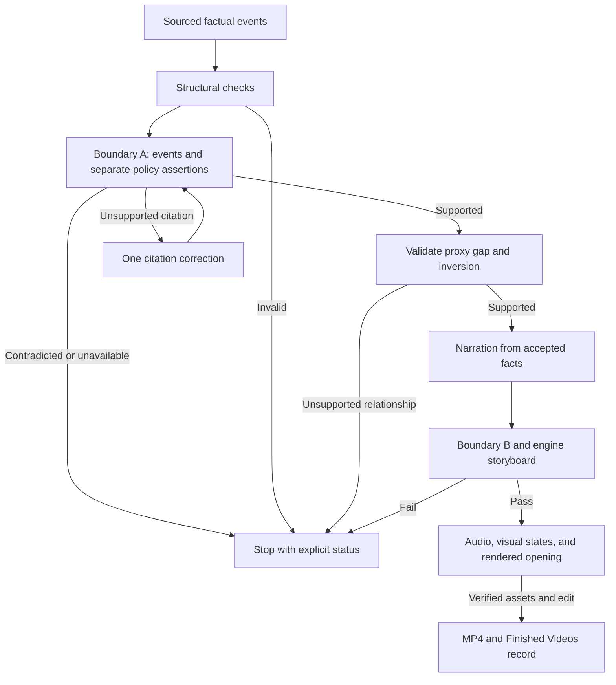

# Illustrated story flow

The `backfiring_solution` lane has one factual sheet. The accepted objects, including narrowed
events and repaired citations, are passed to narration. A stage cannot manufacture a pass from
an absent judgment or substitute an older version of the sheet.



## Contracts

| Layer | Authority and failure behavior |
|---|---|
| Factual planner | Five required event functions; every event has citations. The incentive carries separately cited proof and stated goal. Context and outcome remain optional. |
| Compiler | Engine owns roles. Stable IDs survive retries; synthetic mechanisms are rebuilt once. The compounded exploit supplies the reversal without copying the event. |
| Boundary A | Every event and each incentive assertion receives an explicit result. A structural block, invalid response, or outage is never evidence of support. |
| Narrowing | Only `partially_entailed` may keep the judge's supported core, using the same citations and passing the role/state check. The changed event and its positive finding survive the handoff. |
| Citation repair | One correction after a substantive unsupported/partial assertion verdict. Only the two citation lists may change. The correction is judged again; unchanged inputs reuse content-addressed judgments. Contradictions stop. |
| Derived relationships | The existing evidence judge tests the proxy gap and material inversion against supported facts. Different words, farming vocabulary, or a restated failure do not establish an inversion. |
| Narration | Hinge and closing question are presentation nodes with references to supported context. Historical claims remain bounded by their accepted events and explicit derivation inputs. |
| Storyboard | Compiled roles are preserved. The compiled engine's causal requirements apply; it does not simultaneously require a fictional Alex/Bolt investigation. |
| Media | Narration positions are recomputed from finished words. Evidence states, verified images, audio timing, opening edit, and delivery retain their existing gates. |
| Accounting | Each provider result is recorded immediately, including failed JSON repair responses. Retry subtotals are not charged again. |

`stated_policy_goal` is the planner's field name; the compiler still reads legacy `actual_goal`
in archived sheets. Engines without a factual function map retain their existing role assignment.

## Validation and its limits

The regression fixture starts with a wrong measure citation and an unsupported year. The production
planner caller reaches the real compiler/cascade functions, narrows the event, invokes the citation
repair adapter, judges the changed citation, and expands the actual accepted sheet. Script
fidelity, causal storyboard, evidence-state planning, FFmpeg, durable restart, and the Finished
Videos download route execute. Provider responses, database storage, and Blob storage are test
adapters; the media fixture uses geometric images and tones.

The integration test produces a **90-second H.264/AAC MP4 at 320×180**, verifies its download hash,
and asserts that completed media calls are reused after worker restart. This proves technical
delivery with simulated providers. It does not measure historical accuracy, model reliability,
live credentials/quota, image quality, natural voice quality, or production persistence.

Run the checks from the repository:

```bash
python -m pytest tests/test_story_planning_flow.py tests/test_illustrated_delivery_integration.py -q
python -m pytest -q
python -m pip wheel . --no-deps --no-build-isolation --no-index --wheel-dir /tmp/reelforge-wheels
python scripts/check_installed_wheel.py /tmp/reelforge-wheels/reelforge_ai_video-0.2.0-py3-none-any.whl
```

Live entailment tests are opt-in. Offline tests block external socket connections and mock the
research page fetch as well as provider SDKs. The installed-wheel check imports the story compiler
and its dependencies outside the checkout, so local imports cannot mask missing package modules.

## Live acceptance

After deploying the reviewed revision, check `/api/production-readiness`, then follow `AGENTS.md`
for an immutable `generic_illustrated` proposal: a 90-second Hanoi rat-bounty video, explicit
historical uncertainty, illustrated stills, one voice, and a $5 proposed ceiling. The operator
approves that exact scope once. This document neither creates nor approves that paid action.

The live measurement must report supported required functions, separately supported proof and
goal, supported proxy gap, a supported material inversion, and all conditions on the same sheet.
It must also report actual provider spend, output runtime, shot count, technical validation,
automatic/editorial grades or their unavailable status, and the final artifact. The previous
five-sheet Hanoi result remains a failed baseline; offline fixtures do not replace it with a
claimed 4/5 or 5/5 live success rate.
