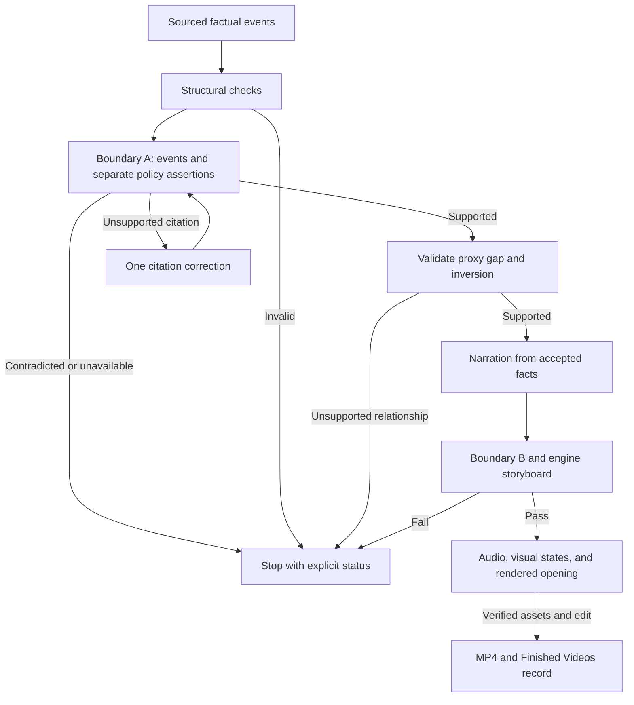

# Illustrated story flow

The `backfiring_solution` lane has one factual sheet. The accepted objects, including narrowed
events and repaired citations, are passed to narration. A stage cannot manufacture a pass from
an absent judgment or substitute an older version of the sheet.



## Contracts

| Layer | Authority and failure behavior |
|---|---|
| Factual planner | Five required event functions; every event has citations. The incentive carries separately cited proof and stated goal. Context and outcome remain optional. |
| Compiler | Engine owns roles. Stable IDs survive retries; synthetic mechanisms are rebuilt once. The compounded exploit supplies the reversal without copying the event. |
| Boundary A | Every event and each incentive assertion receives an explicit result. A structural block, invalid response, or outage is never evidence of support. |
| Narrowing | Only `partially_entailed` may keep the judge's supported core, using the same citations and passing the role/state check. The changed event and its positive finding survive the handoff. |
| Citation repair | Re-fetch retained, page-verified primary sources first and test a bounded exact-passage shortlist through Boundary A. Only unresolved gaps may buy one focused search. Comparison sources cannot repair the primary story; contradictions stop. |
| Derived relationships | The existing evidence judge tests the proxy gap and material inversion against supported facts. Different words, farming vocabulary, or a restated failure do not establish an inversion. |
| Narration | Hinge and closing question are presentation nodes with references to supported context. Historical claims remain bounded by their accepted events and explicit derivation inputs. |
| Storyboard | Compiled roles are preserved. The compiled engine's causal requirements apply; it does not simultaneously require a fictional Alex/Bolt investigation. |
| Media | Narration positions are recomputed from finished words. Evidence states, verified images, audio timing, opening edit, and delivery retain their existing gates. |
| Accounting | Each provider result is recorded immediately, including failed JSON repair responses. Retry subtotals are not charged again. |

`stated_policy_goal` is the planner's field name; the compiler still reads legacy `actual_goal`
in archived sheets. Engines without a factual function map retain their existing role assignment.

## Retention readiness on this lane

`retention_readiness.score_retention_readiness` reads six keys out of `validation["checks"]`, and
the compiled-factual branch of `validate_longform_story` returned before computing any of them. The
scorer's `or` defaults are not neutral:

| key | absent read as | effect |
|---|---|---|
| `max_attention_gap_sec` | `999` | **-8** (a 999-second gap reported on a 75-second video) |
| `prediction_scenes` | falsy | **-5** |
| `answer_scenes` | falsy | **-5** |
| `max_exposition_block_sec` | `0` | **+5**, unearned |
| `unresolved_loops` | falsy | **+5**, unearned |

Plus `scenes[0]["story_role"] == "cold_consequence"`, which no causal engine can satisfy: they all
open on `setup`, and `cold_consequence` is not one of this lane's roles at all. A permanent -5.

Measured: a **perfect** illustrated video scored **77/100 (C)**. An A was arithmetically
unreachable, and the number was not measuring the video.

Three changes. `longform_retention._causal_retention_checks` emits those keys in the causal role
vocabulary, imported from `causal_story` rather than restated, so an engine change cannot leave the
two files disagreeing about what a reversal is. It is measurement only — the causal contract already
fail-closes on structure, and a second set of uncalibrated blocking thresholds is the habit this
lane has too much of. `_measured()` replaces the `or` defaults so absent is distinguishable from a
measured zero. And an unmeasured axis is subtracted from the **denominator** rather than counted as
a loss: components carry `assessed_max`, the grade is the percentage of the assessed total, and
`unmeasured` is listed in the report and the label.

The causal opening is left explicitly unassessed rather than silently decided. Two contracts
disagree about what an opening should be — the engine mandates `setup`, the retention rubric wants a
visible consequence — and which one a causal story should follow is an editorial question, not a
measurement. The mystery lane is untouched.

`build_audio_cues` had the same defect and is fixed with it: it matched `story_role` against
prediction_gate / payoff / reversal / final_payoff / false_relief / rehook, which intersect
`causal_story.STEP_ROLES` at exactly one word. Every illustrated video produced one cue of one type
and scored 2/4 on the palette check. The causal table maps `intervention` and `mechanism` to the
light tick (a wager and a claim, not a landing), `hinge` and `reversal` to the impact (the turn and
the payoff), and `false_resolution` plus the closing `tool`/`verdict` to a bed drop. `escalation`
and `generalization` are repeatable by contract and are never cued — that is the "cue on every cut"
the function exists to avoid. Only the three cues the mixer can actually render are used;
`mechanism`, `reversal` and a closing role are each required of every causal story, so a two-type
palette is structural rather than lucky.

Hard failures still cap the grade at 69 (`semantic_sync < 0.70`, any same-source hard cut, any
sub-minimum shot). Widening the denominator does not let a real defect through.

Re-scored against a recorded live run: the same video, same shots, moves from
`65 (D) — Opening 10/25, Propulsion 17/25` to `raw 78/95 — Opening 20/20, Propulsion 20/25`, still
capped to 69 by two genuine hard failures. The remaining points are all real: semantic cut alignment
27%, four same-source hard cuts, no clause-specific B-roll, one audio cue type, and a 20.1-second
exposition block.

## Validation and its limits

The regression fixture starts with a wrong measure citation and an unsupported year. The production
planner caller reaches the real compiler/cascade functions, narrows the event, invokes the citation
repair adapter, judges the changed citation, and expands the actual accepted sheet. Script
fidelity, causal storyboard, evidence-state planning, FFmpeg, durable restart, and the Finished
Videos download route execute. Provider responses, database storage, and Blob storage are test
adapters; the media fixture uses geometric images and tones.

The integration test produces a **90-second H.264/AAC MP4 at 320×180**, verifies its download hash,
and asserts that completed media calls are reused after worker restart. This proves technical
delivery with simulated providers. It does not measure historical accuracy, model reliability,
live credentials/quota, image quality, natural voice quality, or production persistence.

Run the checks from the repository:

```bash
python -m pytest tests/test_story_planning_flow.py tests/test_illustrated_delivery_integration.py -q
python -m pytest -q
python -m pip wheel . --no-deps --no-build-isolation --no-index --wheel-dir /tmp/reelforge-wheels
python scripts/check_installed_wheel.py /tmp/reelforge-wheels/reelforge_ai_video-0.2.0-py3-none-any.whl
```

Live entailment tests are opt-in. Offline tests block external socket connections and mock the
research page fetch as well as provider SDKs. The installed-wheel check imports the story compiler
and its dependencies outside the checkout, so local imports cannot mask missing package modules.

## Live acceptance

After deploying the reviewed revision, check `/api/production-readiness`, then follow `AGENTS.md`
for an immutable `generic_illustrated` proposal: a 90-second Hanoi rat-bounty video, explicit
historical uncertainty, illustrated stills, one voice, and a $5 proposed ceiling. The operator
approves that exact scope once. This document neither creates nor approves that paid action.

The live measurement must report supported required functions, separately supported proof and
goal, supported proxy gap, a supported material inversion, and all conditions on the same sheet.
It must also report actual provider spend, output runtime, shot count, technical validation,
automatic/editorial grades or their unavailable status, and the final artifact. The previous
five-sheet Hanoi result remains a failed baseline; offline fixtures do not replace it with a
claimed 4/5 or 5/5 live success rate.

## Music and visual identity

New illustrated videos use `ink_cut_paper_v1`: ink contours, restrained crosshatching,
flat gouache and cut-paper shapes, natural skin tones and a navy/teal/terracotta/ivory palette.
Clothing, silhouette and prop anchors retain continuity. Caption accents follow this palette.
The reference videos inform readability and pacing; their script wording, image sequence,
round white character heads, parchment vignette and purple caption cards are not the template.
This is a prompt/rendering change, not a measured claim about live image-model output.

The normal illustrated request now supplies music automatically. `illustrated_score.py` composes
and synthesizes a chamber-style bed locally, with piano, plucked and sustained string timbres.
It uses no reference recording, downloaded samples or paid music provider. This is synthesized
accompaniment, not a recorded orchestra or a promise of exclusive musical ownership.

| Story engine | Musical direction |
|---|---|
| Backfiring solution | Wry minor-key plucks and piano |
| Accumulating indictment | Slower, reflective strings and sparse piano |
| Almost-happened plan | Curious major-key chamber pulse |
| Accidental invention | Brighter discovery theme |
| Power reversal | Measured minor-key tension |

Topic, engine and score version select a repeatable theme; workers reuse checksum-verified WAVs.
Different topics vary the theme, key and voicing. Repeat attempts for the same topic retain the
same identity. FFmpeg normalizes voice/music separately, ducks the music under speech, applies
the existing story-turn drops and fades the ending. The filter behavior is documented in
[FFmpeg's sidechain compressor reference](https://ffmpeg.org/ffmpeg-filters.html#sidechaincompress).
An explicit caller track overrides the default; `bg_music_path=""` disables it. A music-generation
failure is recorded as unavailable and delivery continues with narration.

The generation manifest records the actual score identity, settings, audio hash and status.
The topic proposal's `illustrated_topic_v2` recipe includes the visual/music versions in its
existing immutable hash. Older proposals must be recreated for this changed creative recipe;
their approved payload is never silently changed. The approval card describes the included score.

`tests/test_illustrated_score.py` checks the actual audio: duration, audible signal, clipping,
fades, cache integrity, topic variation and measured voice/music separation after FFmpeg mixing.
The compiled video-delivery fixture also requires a ready local score in the delivered manifest.
A live human review is still needed for musical taste, voice balance on natural narration and
visual distinctiveness on generated artwork.
