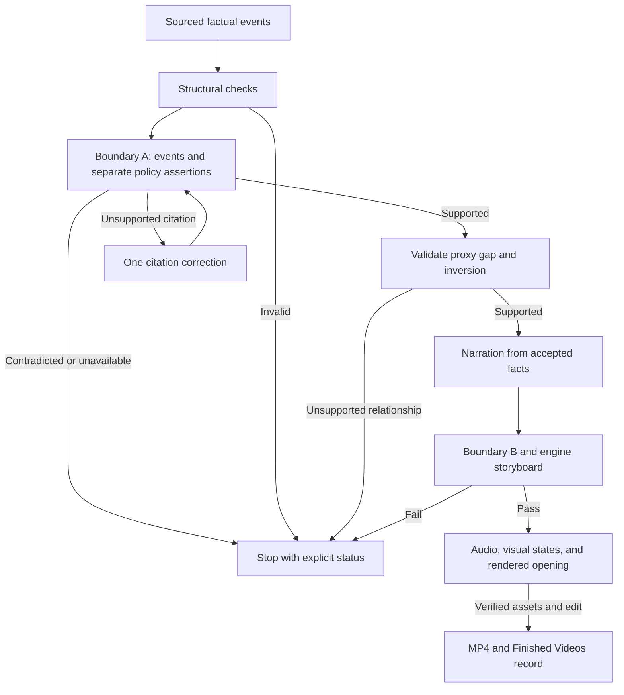

# Illustrated story flow

The `backfiring_solution` lane has one factual sheet. The accepted objects, including narrowed
events and repaired citations, are passed to narration. A stage cannot manufacture a pass from
an absent judgment or substitute an older version of the sheet.



## Contracts

| Layer | Authority and failure behavior |
|---|---|
| Factual planner | Five required event functions; every event has citations. The incentive carries separately cited proof and stated goal. Context and outcome remain optional. |
| Compiler | Engine owns roles. Stable IDs survive retries; synthetic mechanisms are rebuilt once. The compounded exploit supplies the reversal without copying the event. |
| Boundary A | Every event and each incentive assertion receives an explicit result. A structural block, invalid response, or outage is never evidence of support. |
| Narrowing | Only `partially_entailed` may keep the judge's supported core, using the same citations and passing the role/state check. The changed event and its positive finding survive the handoff. |
| Citation repair | Re-fetch retained, page-verified primary sources first and test a bounded exact-passage shortlist through Boundary A. Only unresolved gaps may buy one focused search. Comparison sources cannot repair the primary story; contradictions stop. |
| Derived relationships | The existing evidence judge tests the proxy gap and material inversion against supported facts. Different words, farming vocabulary, or a restated failure do not establish an inversion. |
| Narration | Hinge and closing question are presentation nodes with references to supported context. Historical claims remain bounded by their accepted events and explicit derivation inputs. |
| Storyboard | Compiled roles are preserved. The compiled engine's causal requirements apply; it does not simultaneously require a fictional Alex/Bolt investigation. |
| Media | Narration positions are recomputed from finished words. Evidence states, verified images, audio timing, opening edit, and delivery retain their existing gates. |
| Accounting | Each provider result is recorded immediately, including failed JSON repair responses. Retry subtotals are not charged again. |

`stated_policy_goal` is the planner's field name; the compiler still reads legacy `actual_goal`
in archived sheets. Engines without a factual function map retain their existing role assignment.

## Retention readiness on this lane

`retention_readiness.score_retention_readiness` reads six keys out of `validation["checks"]`, and
the compiled-factual branch of `validate_longform_story` returned before computing any of them. The
scorer's `or` defaults are not neutral:

| key | absent read as | effect |
|---|---|---|
| `max_attention_gap_sec` | `999` | **-8** (a 999-second gap reported on a 75-second video) |
| `prediction_scenes` | falsy | **-5** |
| `answer_scenes` | falsy | **-5** |
| `max_exposition_block_sec` | `0` | **+5**, unearned |
| `unresolved_loops` | falsy | **+5**, unearned |

Plus `scenes[0]["story_role"] == "cold_consequence"`, which no causal engine can satisfy: they all
open on `setup`, and `cold_consequence` is not one of this lane's roles at all. A permanent -5.

Measured: a **perfect** illustrated video scored **77/100 (C)**. An A was arithmetically
unreachable, and the number was not measuring the video.

Three changes. `longform_retention._causal_retention_checks` emits those keys in the causal role
vocabulary, imported from `causal_story` rather than restated, so an engine change cannot leave the
two files disagreeing about what a reversal is. It is measurement only — the causal contract already
fail-closes on structure, and a second set of uncalibrated blocking thresholds is the habit this
lane has too much of. `_measured()` replaces the `or` defaults so absent is distinguishable from a
measured zero. And an unmeasured axis is subtracted from the **denominator** rather than counted as
a loss: components carry `assessed_max`, the grade is the percentage of the assessed total, and
`unmeasured` is listed in the report and the label.

The causal opening is left explicitly unassessed rather than silently decided. Two contracts
disagree about what an opening should be — the engine mandates `setup`, the retention rubric wants a
visible consequence — and which one a causal story should follow is an editorial question, not a
measurement. The mystery lane is untouched.

`build_audio_cues` had the same defect and is fixed with it: it matched `story_role` against
prediction_gate / payoff / reversal / final_payoff / false_relief / rehook, which intersect
`causal_story.STEP_ROLES` at exactly one word. Every illustrated video produced one cue of one type
and scored 2/4 on the palette check. The causal table maps `intervention` and `mechanism` to the
light tick (a wager and a claim, not a landing), `hinge` and `reversal` to the impact (the turn and
the payoff), and `false_resolution` plus the closing `tool`/`verdict` to a bed drop. `escalation`
and `generalization` are repeatable by contract and are never cued — that is the "cue on every cut"
the function exists to avoid. Only the three cues the mixer can actually render are used;
`mechanism`, `reversal` and a closing role are each required of every causal story, so a two-type
palette is structural rather than lucky.

`broll_clause_count` had the same shape of defect one file over. It counted only shots whose
literal `source` is the string `"alternate"`, which the two pre-evidence paths emit and the evidence
lane never does — structurally zero on every illustrated render, with 17 planned states and 12
separately generated assets sitting unseen. It now also counts an evidence state that is
`distinct` (a generated asset, not a crop), `verified_visible_information` (the vision check
confirmed it shows what it claims) and `semantic_aligned` (it lands on its narration clause).
All three conjuncts are load-bearing: without the third, an evenly-spaced placement counts as
clause B-roll, which is the opposite of the name — 6 instead of 2 on the audited run, crediting
four cuts that missed their clause.

Hard failures still cap the grade at 69 (`semantic_sync < 0.70`, any same-source hard cut, any
sub-minimum shot). Widening the denominator does not let a real defect through.

Re-scored against a recorded live run: the same video, same shots, moves from
`65 (D) — Opening 10/25, Propulsion 17/25` to `raw 78/95 — Opening 20/20, Propulsion 20/25`, still
capped to 69 by two genuine hard failures. The remaining points are all real: semantic cut alignment
27%, four same-source hard cuts, no clause-specific B-roll, one audio cue type, and a 20.1-second
exposition block.
## Finished Videos library

A completed illustrated render is archived with `format: "illustrated-story"`, its own lane label,
on the same terms as `short-quiz`. It previously borrowed `explainer`, which made the lane
invisible in the library: same pill as a cinematic explainer, no filter, and `format` was not
searchable in either SQL list path or the local fallback. All three now match on it.

The archived metadata carries the lane facts the library needs without opening the MP4:
`creative_lane`, `creative_profile`, `story_engine`, `chapter_count`, `beat_count`,
`location_count`, `storyboard_validated`, `music_status`, `motion_mode`. They are read from the
generation manifest and storyboard the run already wrote; nothing is re-derived or re-judged, and
an absent fact stays absent rather than defaulting to a reassuring value.

`static/finished.html` groups on that label, folds the one legacy `illustrated-causal-longform` row
into the same lane, and states the delivery/approval distinction explicitly: the rendered gate is
advisory on this lane, so a record can be `status: "done"` with
`rendered_contract_status: "REJECT"`. The card shows the grade next to the status and the detail
view says in words that "done" means the MP4 exists, not that it passed editorial review.

`tests/test_finished_illustrated_lane.py` pins the label, the metadata round-trip, the searchable
lane, and that a failed storyboard validation reaches the record as `false` rather than dropping out.

## Evidence provenance: three states, not two

A cited page has three possible outcomes, and collapsing the last two cost this lane its best
sources. `claim_verify` fetches each page itself; the claim is then one of:

| outcome | `support_provenance` | enters prompts? | excerpt check |
|---|---|---|---|
| quote found verbatim on the page | `verbatim` | yes | applies |
| quote recovered from the page by overlap + matching polarity | `page_recovered` | yes | applies |
| page could not be retrieved (403, refused connection) | `provider_attested_unfetchable` | yes, unpromoted | exempt |
| page read, quote absent | — (dropped) | no | n/a |

Measured on one topic: of 16 claims that failed the quote check, **13 were transport failures** —
`nma.gov.au` returns 403 to any non-browser client including its homepage, `dcceew.gov.au` refuses
the connection, Wiley and Britannica 403 — and only 3 were pages that were read and did not contain
the quote. The 13 were the story's spine. Dropping them left 11 claims and three downstream gates
then failed on the same hole in three different vocabularies. Carrying them takes the same dossier
to 23 claims and `validate_research_dossier` passes.

An attested claim is **carried, not promoted**: `quote_verified` stays false, it contributes no
citation record, and it is exempt from `unverified_support_quote` only because that check asks a
question nobody can answer for it. Every other guard still applies — the URL must appear in the
provider's own citations, the domain must not be weak, the quote must exist, and negation must
agree. `no_fetched_evidence` fails a dossier in which *nothing* was read at any URL; zero is the
only threshold here that is not arbitrary, and a partial outage is reported rather than blocked.

`repair_quote` will no longer substitute a page sentence whose negation direction differs from the
claim's. It cannot separate a statement of intent from a statement of outcome — no word-overlap
rule can — so the evidence judge is now shown each claim's `support_quote`, `source_url` and
provenance and told that a passage describing what something was *intended* to do does not
establish that it did.

## Opening evidence assets

`insufficient_distinct_evidence_assets` requires an opening beat with room for two states to carry
two generated assets, or a detail reframe whose crop has been pixel-verified. At plan time no image
exists, so the second option can never be true, and which strategy the opening's second beat uses is
the model's choice. That made the abort a coin flip on one token, after research, script, fact-check
and claim repair were all paid for. An opening `detail_reframe` is now promoted to `distinct` when
the opening would otherwise carry fewer than two generated assets — one extra image, ~$0.045,
against a ~$1.50 abort — and the change is recorded in the plan's `repairs` list rather than
silently differing from the script. Reframes outside the opening, and reframes in an opening that
already carries two generated assets, are untouched.

## Story-engine corpus support

Engine selection now states its corpus support in the run log
(`removed_keystone — 0 corpus references, loose adherence`). This is reporting, not a gate: the
corpus's authority split reserves gating for measured data, and reference *count* is neither
measured nor judged. An engine at zero references still receives no reference blueprint, but its
declared sequence and required roles are shown to the labeller through `story_engines.catalogue()`,
so it is not judged against an order it was never given.
## Shot timing: repair the scene, do not discard it

`compile_scene_shots` resolved each evidence state's anchor against measured word timings and then
applied a single **whole-scene** verdict: if any start was out of order or too close to its
neighbour, every start in the scene was replaced with even spacing and every shot reported
`semantic_aligned: False`.

Measured on a real 75.1-second render, two of five scenes collapsed and took nine cuts with them:

| scene | cause | margin |
|---|---|---|
| 3 | tail of 1.49 s against `MIN_SHOT_SECONDS = 1.5` | **0.01 s** |
| 5 | the callback anchored to word 9 of 59, but it is the **last** shot | 16.5 s out of order |

The matcher was not at fault — it resolved 15 of 16 phrases exactly and one by fuzzy match. The
reported `semantic_sync_ratio` was 27%, under the 0.70 hard-failure line, for a cut whose timings
were almost all correct.

**The callback anchor is now derived from the closing clause.** It returns to the opening object
after the answer lands, so it is always the last shot and its anchor has to resolve last. Both
previous sources guaranteed the opposite: `motion_anchor_phrase` is chosen for motion, not
position, and the fallback took the *preceding* state's anchor. When the final clause is already
claimed by the last evidence state — which is common — a strict suffix of it is used, comparing on
words rather than punctuation so `"…back"` and `"…back."` are not treated as different.

**A scene that does not fit is repaired, not discarded.** A forward pass pushes each start to at
least `MIN_SHOT_SECONDS` after its predecessor and a backward pass caps it so the remaining states
still fit; feasibility is already guaranteed by the existing precheck, so no new constant appears.
This cannot launder the metric: a state that had to be *moved* no longer sits within 0.05 s of its
phrase, so the per-shot check reports it unaligned — which is true, its picture no longer lands on
its words. `timing_source` records `measured`, `repaired` or `even_fallback` per shot, so a low
ratio can be attributed instead of guessed at.

Replaying the recorded render through the fixed compiler takes `semantic_sync_ratio` from **27% to
73%**, above the hard-failure line, with 13 shots `measured` and 3 `repaired` and denied credit.
The replay approximates within-scene word timings, so the exact figure needs a live run; the
ordering it depends on is real.

## A detail reframe is a push, not a cut

A detail reframe crops the shot immediately before it, so cutting to it shows the same picture
suddenly larger. Measured on the rendered gate's own before/after frames from a real render, two of
these were near-identical across the cut (mean pixel difference **16/255**, against 24-67 for
genuine cuts between different pictures).

The renderer now performs the move instead. When a reframe crops its immediate predecessor,
`_make_multishot_background` renders it **from the master** with the `push_to_detail` camera move:
a `zoompan` from full frame to `1/DETAIL_REFRAME_CROP`, centred, so the last frame of the move is
exactly the crop. Verified by rendering one: the final frame differs from the accepted crop by
**1.50/255** while first-to-last differs by 11.25 — it lands on the crop, and it really moves.

Nothing unverified reaches the screen. The end of the push is the reframe the inspector accepted;
every frame before it is the master it also accepted.

`DETAIL_REFRAME_CROP` is named once and used by both the cropper and the camera move. If they drift
the push ends somewhere the verifier never looked.

Only the crop of the **immediately preceding** shot becomes a push. A reframe of some earlier asset
is a real change of picture and stays a cut — and is correctly not a same-source jump cut either,
because the picture before it on screen is a different asset.

### What this does to the metric, and why it is earned

`same_source_hard_cut_count` counts a hard cut whose source matches the previous shot's. Those cuts
no longer exist, so on the recorded render it goes **4 → 0** and the hard failure clears. The count
drops because the edit changed, not because the rule did — the rule is untouched.

Its one remaining live path is the fallback: when the master is not on disk the push cannot be
performed, the shot is downgraded to `hard_cut` **on the caller's list** (not just on the local
copy `_make_multishot_background` works from), and the metric counts it. A fallback nobody can
measure is how a quality gate quietly stops measuring anything, so that write-back is load-bearing
and has its own test.

## Validation and its limits

The regression fixture starts with a wrong measure citation and an unsupported year. The production
planner caller reaches the real compiler/cascade functions, narrows the event, invokes the citation
repair adapter, judges the changed citation, and expands the actual accepted sheet. Script
fidelity, causal storyboard, evidence-state planning, FFmpeg, durable restart, and the Finished
Videos download route execute. Provider responses, database storage, and Blob storage are test
adapters; the media fixture uses geometric images and tones.

The integration test produces a **90-second H.264/AAC MP4 at 320×180**, verifies its download hash,
and asserts that completed media calls are reused after worker restart. This proves technical
delivery with simulated providers. It does not measure historical accuracy, model reliability,
live credentials/quota, image quality, natural voice quality, or production persistence.

Run the checks from the repository:

```bash
python -m pytest tests/test_story_planning_flow.py tests/test_illustrated_delivery_integration.py -q
python -m pytest -q
python -m pip wheel . --no-deps --no-build-isolation --no-index --wheel-dir /tmp/reelforge-wheels
python scripts/check_installed_wheel.py /tmp/reelforge-wheels/reelforge_ai_video-0.2.0-py3-none-any.whl
```

Live entailment tests are opt-in. Offline tests block external socket connections and mock the
research page fetch as well as provider SDKs. The installed-wheel check imports the story compiler
and its dependencies outside the checkout, so local imports cannot mask missing package modules.

## Live acceptance

After deploying the reviewed revision, check `/api/production-readiness`, then follow `AGENTS.md`
for an immutable `generic_illustrated` proposal: a 90-second Hanoi rat-bounty video, explicit
historical uncertainty, illustrated stills, one voice, and a $5 proposed ceiling. The operator
approves that exact scope once. This document neither creates nor approves that paid action.

The live measurement must report supported required functions, separately supported proof and
goal, supported proxy gap, a supported material inversion, and all conditions on the same sheet.
It must also report actual provider spend, output runtime, shot count, technical validation,
automatic/editorial grades or their unavailable status, and the final artifact. The previous
five-sheet Hanoi result remains a failed baseline; offline fixtures do not replace it with a
claimed 4/5 or 5/5 live success rate.

## Music and visual identity

New illustrated videos use `ink_cut_paper_v1`: ink contours, restrained crosshatching,
flat gouache and cut-paper shapes, natural skin tones and a navy/teal/terracotta/ivory palette.
Clothing, silhouette and prop anchors retain continuity. Caption accents follow this palette.
The reference videos inform readability and pacing; their script wording, image sequence,
round white character heads, parchment vignette and purple caption cards are not the template.
This is a prompt/rendering change, not a measured claim about live image-model output.

The normal illustrated request now supplies music automatically. `illustrated_score.py` composes
and synthesizes a chamber-style bed locally, with piano, plucked and sustained string timbres.
It uses no reference recording, downloaded samples or paid music provider. This is synthesized
accompaniment, not a recorded orchestra or a promise of exclusive musical ownership.

| Story engine | Musical direction |
|---|---|
| Backfiring solution | Wry minor-key plucks and piano |
| Accumulating indictment | Slower, reflective strings and sparse piano |
| Almost-happened plan | Curious major-key chamber pulse |
| Accidental invention | Brighter discovery theme |
| Power reversal | Measured minor-key tension |

Topic, engine and score version select a repeatable theme; workers reuse checksum-verified WAVs.
Different topics vary the theme, key and voicing. Repeat attempts for the same topic retain the
same identity. FFmpeg normalizes voice/music separately, ducks the music under speech, applies
the existing story-turn drops and fades the ending. The filter behavior is documented in
[FFmpeg's sidechain compressor reference](https://ffmpeg.org/ffmpeg-filters.html#sidechaincompress).
An explicit caller track overrides the default; `bg_music_path=""` disables it. A music-generation
failure is recorded as unavailable and delivery continues with narration.

The generation manifest records the actual score identity, settings, audio hash and status.
The topic proposal's `illustrated_topic_v2` recipe includes the visual/music versions in its
existing immutable hash. Older proposals must be recreated for this changed creative recipe;
their approved payload is never silently changed. The approval card describes the included score.

`tests/test_illustrated_score.py` checks the actual audio: duration, audible signal, clipping,
fades, cache integrity, topic variation and measured voice/music separation after FFmpeg mixing.
The compiled video-delivery fixture also requires a ready local score in the delivered manifest.
A live human review is still needed for musical taste, voice balance on natural narration and
visual distinctiveness on generated artwork.
